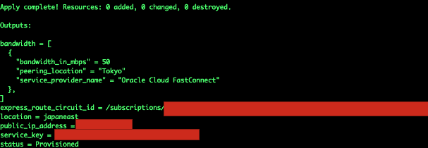

# Azure Oracle Cloud nterconnection

Oracle has partnered with Microsoft to provide low latency, private connectivity between Oracle Cloud and Microsoft Azure. 
Please refer to https://docs.oracle.com/en/solutions/learn-azure-oci-interconnect/index.html#GUID-FBE38C70-A4CF-40C5-A37A-121241D21199


I assume there is Oracle DB(ADB, DBaaS, or ExaCS) provisioned in Oracle Cloud, hence this Terraform will help you complete all prerequisites in Azure. 


### Prerequisites in Azure

Your will need Virtual Network Gateway, ExpressRT, Network Security Group, Route table, etc in Azure end. 
Only thing you need is to change CIDR , Region , shape if needed. 
This terraform will use 50Mbps bandwidth for Express Route.

Default CIDR: 10.1.0.0/16

Default Region: Tokyo

```sh
1. update provider.tf with your Azure account details
2. Terraform Plan
3. Terraform Apply
4. Log into VM(Azure) 
5. Conenct to Database(Oracle Cloud) 
```

### Known issue in Azure Terraform
output.tf works after only all is provisioned. I experienecd this behavior when using Azure provider. 

```sh
# workaround
 1. complete the existing terraform scripts without changing any. Once it's done, please go to step #2.
 2. mv output.tf.bak output.tf
 3. terraform apply
 4. you will see the details as follows
 5. Copy service Key from the output and paste it when FastConnect is created in Oracle Cloud to complete interconnection between FastConnect and ExpressRT

```
 

### Expected cost in Azure for this demo
If you want to provision resources in Oracle cloud, you may try to use OKIT where you can get Terraform, Ansible script by dragging/dropping service icons or directly provision it using Oracle Resource Manager that is managed Terraform service. 
Video: https://www.youtube.com/watch?v=7Dg-6RMBbqs&feature=youtu.be&list=PLvlciYga5j3yY-8t5V6DFHy1ecqxOJsrc

Now that I am also one of contributors for OKIT development, please let me know if there is featuer request or any better idea.

GitHub: https://github.com/oracle/oci-designer-toolkit

### Expected cost in Azure for this demo
This Azure Terraform will not cost more than 1 dollar with ExpressRT and others for 1~2 hours demo unless you let it run for 24 hours or more.
There will be a test VM which will be automatically provisioned as B1ls that is the smallest shape at this moment.(USD 3.8 for a month, hence it will be less than 10 cents for this demo)

